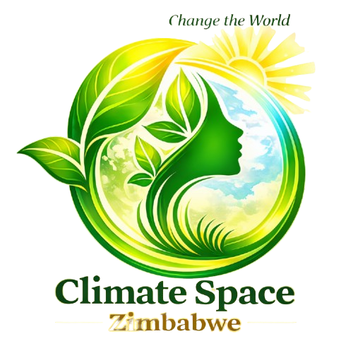

<div align="center">
  

  # Climate Space Zimbabwe
  ### *Climate Action meets Intelligence*

  [Product Catalog](./docs/PRODUCTS.md) • [Development Setup](./docs/SETUP.md) • [Architecture](./docs/ARCHITECTURE.md)

  [](https://opensource.org/licenses/MIT)
  [](https://nextjs.org/)
  [](https://tailwindcss.com/)
  [](https://www.typescriptlang.org/)
</div>

---

## 🌍 The Mission

**Climate Space Zimbabwe** is a youth-led movement fusing **Artificial Intelligence** with **Creative Arts** to build climate resilience in Zimbabwe. We transform complex environmental data into actionable insights for farmers and compelling narratives for the public.

## 💡 Core Pillars (Hurudzai AI)

Our platform serves as an ecosystem for climate intelligence:

*   **🌾 Smart Agriculture**: The *Agri-Search Engine* provides localized planting advice and pest identification tuned for Zimbabwe's agro-ecological zones.
*   **🎨 Creative Advocacy**: Our *Creative Space* uses digital art and storytelling to drive environmental awareness and community action.
*   **📚 Knowledge Democracy**: A centralized *Climate Library* providing students and researchers with accessible environmental reports.

## 🛠️ Tech Stack

Built for performance and accessibility on local networks:

- **Framework**: [Next.js 14](https://nextjs.org/) (App Router)
- **Styling**: [Tailwind CSS](https://tailwindcss.com/) with a custom design system
- **Icons**: [Lucide React](https://lucide.dev/)
- **Components**: Custom-built using Radix UI primitives for accessibility
- **Fonts**: Inter (UI) & Plus Jakarta Sans (Headings)

## 📁 Architecture Overview

```text
├── docs/               # Detailed strategy, branding, and technical specs
├── public/             # Optimized brand assets and 3D icons
├── src/
│   ├── app/            # Pages, layouts, and global styles
│   ├── components/     # UI library and feature-specific components
│   └── lib/            # Shared logic and utility functions
└── tailwind.config.ts  # Design system tokens (Green, Gold, Cyan palette)
```

## 🚦 Quick Start

### 1. Prerequisite
Ensure you have **Node.js 18+** and **npm/pnpm** installed.

### 2. Installation
```bash
git clone https://github.com/PraiseTechzw/climate-space-zimbabwe-web.git
cd climate-space-zimbabwe-web
npm install
```

### 3. Running Locally
```bash
npm run dev
```
Open [http://localhost:3000](http://localhost:3000) to see the application.

## 🤝 Contributing

We are an open-participation movement. Whether you are a developer, artist, or climate researcher, your voice matters. 

- Review our **[Contributing Guidelines](CONTRIBUTING.md)**.
- Check our **[Governance Structure](./docs/GOVERNANCE_STRUCTURE.md)** for ethics and leadership protocols.

## 📄 License

This project is licensed under the **MIT License** - see the [LICENSE](LICENSE) file for details.

---
<div align="center">
  Built with ❤️ for a Greener Zimbabwe.
</div>

